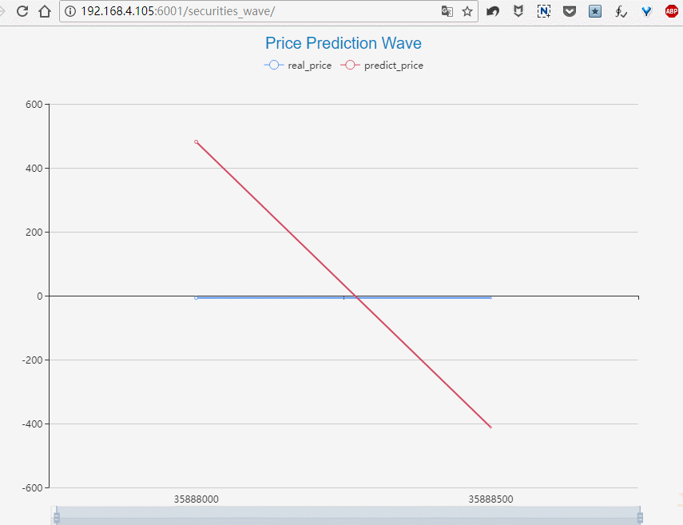

# stock_wave

Show stock forecast price in real time! Send json Use websocket.

### Screenshot



### How to use

web-front: use ECharts draw graph.
py_websocket: send json data to web-front
```json
{ 
  "msg_type" : 99981 ,
  "timems" : 1,
  "code": "ru1801",
  "realpx" : 98, 
  "predict" : 100 
}
```
### Improve

1 Need support reconnect! 
